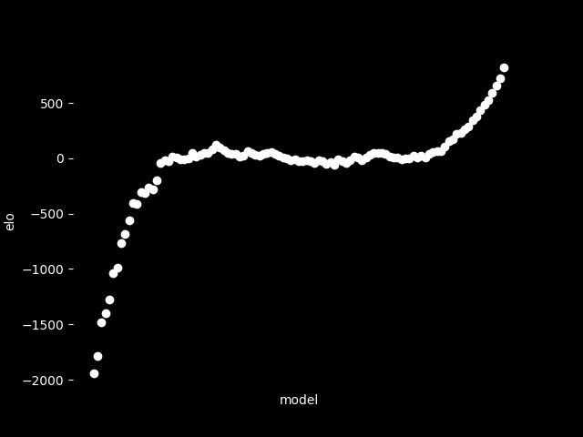

[Mastering the game of Go without human knowledge](https://www.nature.com/articles/nature24270.epdf?author_access_token=VJXbVjaSHxFoctQQ4p2k4tRgN0jAjWel9jnR3ZoTv0PVW4gB86EEpGqTRDtpIz-2rmo8-KG06gqVobU5NSCFeHILHcVFUeMsbvwS-lxjqQGg98faovwjxeTUgZAUMnRQ)

[KataGo](https://github.com/lightvector/KataGo)

[Adversarial policies in Go](https://goattack.far.ai/)

# intro
[Convolutional neural network](https://en.wikipedia.org/wiki/Convolutional_neural_network)

[Residual neural network](https://en.wikipedia.org/wiki/Residual_neural_network)

[Monte Carlo tree search](https://en.wikipedia.org/wiki/Monte_Carlo_tree_search)

[Cross-entropy](https://en.wikipedia.org/wiki/Cross_entropy)

[Gradient descent](https://en.wikipedia.org/wiki/Gradient_descent)

[Backpropagation](https://en.wikipedia.org/wiki/Backpropagation)

[Whole-History Rating: A Bayesian Rating System for Players of Time-Varying Strength](https://www.remi-coulom.fr/WHR/)

[Zobrist hashing](https://en.wikipedia.org/wiki/Zobrist_hashing)

# elo 9x9

